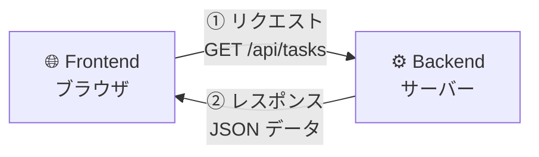
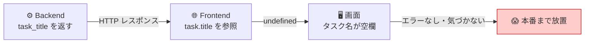
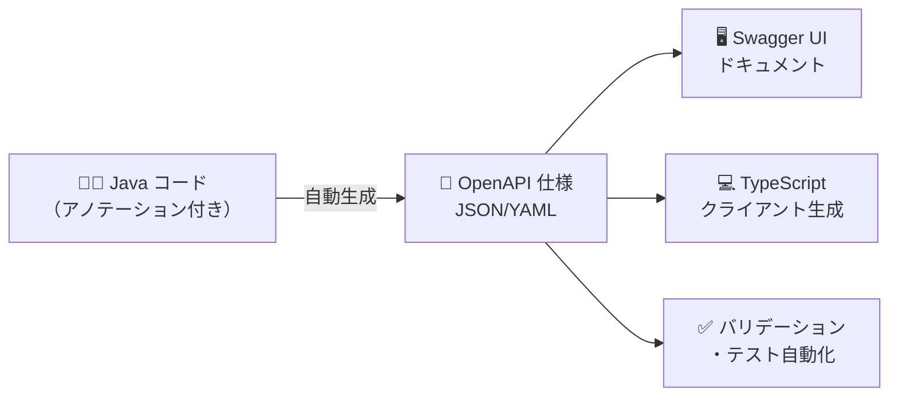
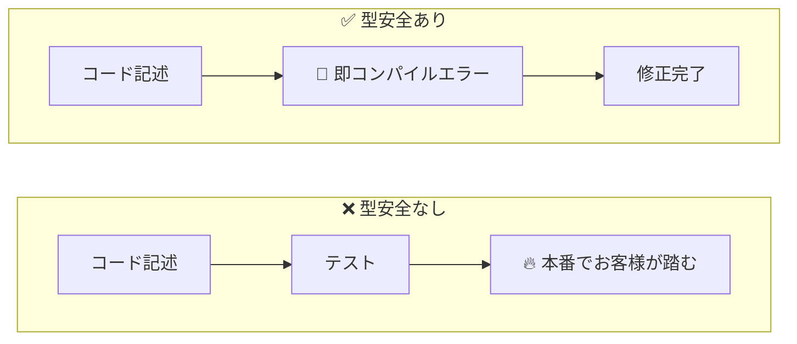
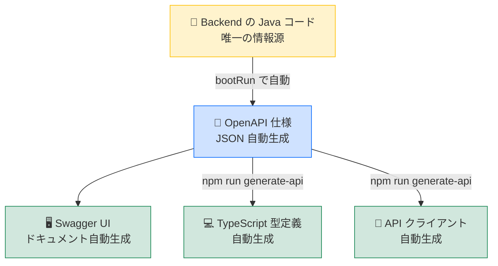

# 🔄 Swagger Hands-on: 型安全なフルスタック開発

**Spring Boot (Java) + Next.js (TypeScript) + OpenAPI/Swagger**

Backend で定義した API から Swagger (OpenAPI) 仕様を自動生成し、その定義を使って Frontend の TypeScript クライアントコードを自動生成する、型安全なフルスタックアプリケーションのハンズオンです。

---

## 📖 目次

1. [はじめに（目標・タイムライン）](#-はじめに)
2. [事前知識（用語解説）](#-事前知識用語解説)
3. [全体アーキテクチャ](#-全体アーキテクチャ)
4. [前提条件](#-前提条件)
5. [クイックスタート](#-クイックスタート)
6. [ハンズオン手順](#-ハンズオン手順)
   - [Step 1: Backend の理解](#step-1-backend-の理解)
   - [Step 2: Swagger UI の確認](#step-2-swagger-ui-の確認)
   - [Step 3: OpenAPI 仕様の確認](#step-3-openapi-仕様の確認)
   - [Step 4: TypeScript クライアント生成](#step-4-typescript-クライアント生成)
   - [Step 5: Frontend から API を呼び出す](#step-5-frontend-から-api-を呼び出す)
   - [Step 6: 型安全の恩恵を体験](#step-6-型安全の恩恵を体験)
7. [プロジェクト構成](#-プロジェクト構成)
8. [技術スタック](#-技術スタック)
9. [演習課題](#-演習課題)
10. [トラブルシューティング](#-トラブルシューティング)
11. [よくある質問](#-よくある質問)
12. [参考リンク](#-参考リンク)

---

## � はじめに

このハンズオンは、**プログラミング経験はあるが OpenAPI / Swagger を使ったことがない方**を対象にしています。「API の設計情報を一か所に集め、Frontend の型定義まで自動で同期する」仕組みを、手を動かして体験するのがゴールです。

### 🎯 このハンズオンで身につくこと

| # | 学習項目 |
|---|----------|
| 1 | API / OpenAPI / Swagger / 型安全の違いと関係を説明できる |
| 2 | Spring Boot が OpenAPI 仕様を自動生成する仕組みを理解できる |
| 3 | OpenAPI 仕様から TypeScript クライアントを生成して使える |
| 4 | **「Backend 変更 → Frontend で型エラー」** の流れを体験できる |

### ⏱ 2時間タイムライン

| ブロック | 内容 | 目安 |
|---------|------|------|
| ① 知識編 | 用語解説・全体像の把握（本ページ「事前知識」を読む） | 20分 |
| ② 環境構築 | Java / Node.js 確認・Backend 起動 | 20分 |
| ③ API 観察 | Swagger UI で API を触る・OpenAPI JSON を確認 | 20分 |
| ④ 生成体験 | TypeScript クライアント生成・生成コードを読む | 20分 |
| ⑤ 連携体験 | Next.js から生成クライアントで API を呼び出す | 20分 |
| ⑥ 型安全体験 | Backend 変更 → Frontend に型エラーが伝播する体験 | 20分 |

> ⚠️ 環境構築（②）は PC の状態によって時間がかかることがあります。事前に [前提条件](#-前提条件) を確認して必要なツールをインストールしておくことを推奨します。

---

## 📚 事前知識（用語解説）

コードに入る前に、ハンズオン全体で使う言葉を整理します。すでに知っている方もざっと確認しておくと後のコードが理解しやすくなります。

---

### 💬 API とは？

**API（Application Programming Interface）** は、プログラム同士が会話するための「約束事」です。Web アプリケーションでは、画面（Frontend）とサーバー（Backend）の間のやり取りに使われます。



この「約束事」には次の内容が含まれます。

| 要素 | 例 |
|------|----|
| URL とメソッド | `GET /api/tasks` |
| リクエストパラメーター | `?status=TODO` |
| レスポンスの形式 | `[{ "id": 1, "title": "...", "status": "TODO" }]` |
| エラーの形式 | `{ "code": 400, "message": "タイトルは必須です" }` |

**🚨 約束事がズレると何が起きる？**

たとえば Backend 開発者が「フィールド名を `title` から `task_title` に変更した」ケースで考えてみましょう。

**① Backend が返す HTTP レスポンス（変更後）**

```json
// GET /api/tasks/1 のレスポンス
{
  "id": 1,
  "task_title": "Swagger定義を作成する",
  "status": "TODO",
  "priority": "HIGH"
}
```

> フィールド名が `title` → `task_title` に変わりました。

**② Frontend のコード（変更を知らず `task.title` を参照し続けている）**

```javascript
// タスク詳細を表示するコンポーネントなどで
const response = await fetch("http://localhost:8080/api/tasks/1");
const task = await response.json();

// JSON には "title" キーが存在しない → undefined が返る（エラーは出ない！）
console.log(task.title);      // undefined

// 画面への描画
document.getElementById("task-title").textContent = task.title;
// → タスク名の欄が空欄になる
```

**③ ブラウザで見える結果（画面が壊れる）**

```
┌─────────────────────────────────────────┐
│ タスク一覧                               │
├─────────────────────────────────────────┤
│ ID: 1                                   │
│ タスク名:                    ← 空欄！    │
│ ステータス: TODO                         │
└─────────────────────────────────────────┘

← 本来は "Swagger定義を作成する" が表示されるべき
```

**なぜこのバグは気づきにくいのか？**

| 問題 | 理由 |
|------|------|
| JavaScript はエラーを出さない | 存在しないキーを参照しても `undefined` を返すだけ（クラッシュしない） |
| 画面がクラッシュしない | 空欄になるだけでアプリは動き続ける |
| 発覚が遅れる | テスト・コードレビュー・本番でお客様が踏むまで誰も気づかない |



---

### 📄 OpenAPI とは？

**OpenAPI Specification（OAS）** は、API の約束事を **機械が読める JSON/YAML 形式** で記述するための標準仕様です。



「機械が読める」ことの価値は **ツールによる自動化** です。

| 従来のドキュメント（Word/Confluence） | OpenAPI 仕様 |
|---------------------------------------|--------------|
| 人間が手で書く → すぐ古くなる | コードから自動生成できる |
| 人が読むだけ | ツールが自動処理できる |
| 実装と乖離しやすい | 実装と常に同期 |

#### OpenAPI ドキュメントの構造

OpenAPI 仕様は大きく **3 つのブロック** で構成されています。

| ブロック | 役割 | このプロジェクトでの例 |
|---------|------|---------------------|
| `info` | API 全体のメタ情報 | タイトル・バージョン・説明 |
| `paths` | エンドポイントの定義 | `GET /api/tasks` のパラメーターやレスポンス型 |
| `components.schemas` | データモデルの定義 | `Task` の各フィールドの型・制約・enum 値 |

#### Java アノテーション → OpenAPI 仕様の対応

このプロジェクトでは **SpringDoc OpenAPI** ライブラリを使い、Java のアノテーションが自動で OpenAPI 仕様 JSON に変換されます。

| Java のコード | 生成される OpenAPI の意味 |
|-------------|------------------------|
| `@Schema(description = "タスクID")` | フィールドの説明文 |
| `@Schema(accessMode = READ_ONLY)` | `"readOnly": true` |
| `@Schema(requiredMode = REQUIRED)` | `required` 配列に追加 |
| `@NotBlank` / `@Size(max = 200)` | `"minLength"` / `"maxLength": 200` |
| `enum TaskStatus { TODO, DONE }` | `"enum": ["TODO", "DONE"]` |
| `@Tag(name = "Tasks")` | Swagger UI でのグループ名（タブ） |
| `@Operation(summary = "一覧取得")` | エンドポイントの概要説明 |
| `@ApiResponse(responseCode = "200")` | レスポンスステータスの定義 |

#### 実際に生成される OpenAPI JSON（抜粋）

Backend を起動して http://localhost:8080/api-docs にアクセスすると、次のような JSON が返ってきます。

```json
{
  "openapi": "3.0.1",
  "info": {
    "title": "Swagger Hands-on API",
    "version": "1.0.0"
  },
  "paths": {
    "/api/tasks": {
      "get": {
        "tags": ["Tasks"],
        "summary": "タスク一覧取得",
        "parameters": [
          {
            "name": "status",
            "in": "query",
            "schema": {
              "type": "string",
              "enum": ["TODO", "IN_PROGRESS", "IN_REVIEW", "DONE"]
            }
          }
        ],
        "responses": {
          "200": {
            "content": {
              "application/json": {
                "schema": {
                  "type": "array",
                  "items": { "$ref": "#/components/schemas/Task" }
                }
              }
            }
          }
        }
      }
    }
  },
  "components": {
    "schemas": {
      "Task": {
        "required": ["title", "status", "priority"],
        "properties": {
          "id":       { "type": "integer", "readOnly": true },
          "title":    { "type": "string",  "maxLength": 200 },
          "status":   { "type": "string",  "enum": ["TODO", "IN_PROGRESS", "IN_REVIEW", "DONE"] },
          "priority": { "type": "string",  "enum": ["LOW", "MEDIUM", "HIGH", "CRITICAL"] }
        }
      }
    }
  }
}
```

> 💡 `"$ref": "#/components/schemas/Task"` は「`Task` の定義は `components.schemas.Task` を参照してください」という意味です。同じモデルを複数のエンドポイントで再利用できます。

このフォーマットが「機械可読」であるため、Swagger UI や openapi-typescript-codegen などのツールが JSON を読み込んでドキュメントやコードを**自動生成**できます。

---

### 🛠 Swagger とは？

**Swagger** は OpenAPI 仕様を扱う**ツール群のブランド名**です。よく混同されますが、現在は「仕様」と「ツール」で名前が分かれています。

```
2011年  Swagger 誕生（API 記述仕様 + ツール群のブランド）
  ↓
2015年  仕様部分を Linux Foundation に寄贈
        → 仕様の名称が「OpenAPI Specification」に改名
  ↓
現在    OpenAPI = 仕様のルール
        Swagger = ツール群（UI・Editor・Codegen）
```

| ツール | 役割 | このハンズオンでの使いどころ |
|--------|------|--------------------------|
| **Swagger UI** | ブラウザで API を確認・実行 | Step 2 |
| **Swagger Editor** | 仕様をオンラインで編集 | 参考 |
| **Codegen 系** | コードを生成 | Step 4 |

> 💡 **まとめ: OpenAPI = 設計図のルール、Swagger = 設計図を扱う道具箱**

---

### 🔒 型安全とは？

**型安全（Type Safety）** とは、「間違ったデータの扱いを実行前に検知できる」性質です。このハンズオンでは OpenAPI から TypeScript 型を自動生成することで実現します。

#### ❌ 型がない世界（素の JavaScript）

```javascript
const task = await fetch("/api/tasks/1").then(r => r.json());

console.log(task.tittle);   // タイポ → undefined（エラーにならない！）
task.stats;                  // typo  → undefined（エラーにならない！）
// 実行して画面が壊れるまで気づけない
```

#### ✅ 型がある世界（OpenAPI から生成した TypeScript）

```typescript
import type { Task } from "@/generated/api/models/Task";

const task: Task = await TasksService.getTask(1);

task.tittle;                    // ❌ コンパイルエラー！（typo を即座に検知）
task.stats;                     // ❌ コンパイルエラー！（stats は存在しない）
task.status = "YOLO";          // ❌ コンパイルエラー！（許可された値ではない）
task.status = Task.status.TODO; // ✅ OK
```

**バグが発見されるタイミングの違い:**



| | 型安全なし | 型安全あり |
|--|-----------|----------|
| バグ発見タイミング | 実行時・テスト時・本番 | コーディング中（即座） |
| 修正コスト | 高い（原因調査が必要） | 低い（エラー箇所が明確） |
| リファクタリング | 怖い（影響範囲不明） | 安心（壊れたら教えてくれる） |
| 新メンバーへの情報伝達 | ドキュメント頼り | 型が「生きたドキュメント」 |

---

### 🏆 なぜこのアプローチが強力なのか

このハンズオンのアプローチは **Single Source of Truth（唯一の情報源）** と呼ばれます。



**従来の開発との比較:**

```
【従来】
  Backend のコード  ←→  手動で同期  ←→  API ドキュメント  ←→  手動で同期  ←→  Frontend のコード
  （3つがバラバラ。ズレが起きやすい。ズレに気づきにくい。）

【このハンズオンのアプローチ】
  Backend のコード（唯一の情報源）
      ↓ 自動生成
  OpenAPI 仕様
      ↓ 自動生成
  Swagger UI ドキュメント + TypeScript 型 + API クライアント
  （すべてが Backend から自動で導出される。手動同期が不要。）
```

---

## �🏗 全体アーキテクチャ

```
┌─────────────────────────────────────────────────────────────┐
│                      開発フロー                              │
│                                                             │
│  ① Java コードに OpenAPI アノテーション付与                    │
│     ↓                                                       │
│  ② Spring Boot 起動 → OpenAPI JSON 自動生成                  │
│     (http://localhost:8080/api-docs)                         │
│     ↓                                                       │
│  ③ openapi-typescript-codegen で TypeScript 型・Client 生成  │
│     ↓                                                       │
│  ④ Next.js Frontend で型安全に API 呼び出し                   │
│                                                             │
└─────────────────────────────────────────────────────────────┘

┌──────────────┐     OpenAPI JSON      ┌──────────────────┐
│  Spring Boot │ ──────────────────►  │  openapi-ts-     │
│  Backend     │  /api-docs            │  codegen         │
│  :8080       │                       │                  │
│              │◄──── REST API ─────── │  Next.js         │
│  Swagger UI  │                       │  Frontend :3000  │
│  /swagger-ui │                       │                  │
└──────────────┘                       └──────────────────┘
```

### 🔑 ポイント

- **Backend が Single Source of Truth（唯一の情報源）**
- Java のモデルクラス・コントローラーに付与したアノテーションから OpenAPI 仕様が**自動生成**される
- その仕様から TypeScript の型・API クライアントが**自動生成**される
- Backend の API を変更すると、Frontend 側のコードで**コンパイルエラー**として検出できる

---

## 📋 前提条件

| ツール     | バージョン  | 確認コマンド         |
|-----------|-----------|-------------------|
| Java (JDK) | 17 以上   | `java -version`   |
| Node.js    | 18 以上   | `node -v`         |
| npm        | 9 以上    | `npm -v`          |
| Git        | 任意      | `git --version`   |

---

## 🚀 クイックスタート

### 1. リポジトリをクローン

```bash
git clone https://github.com/<your-username>/swagger-handson.git
cd swagger-handson
```

### 2. Backend を起動

```bash
cd backend
./gradlew bootRun
```

起動すると以下にアクセスできます:
- **Swagger UI**: http://localhost:8080/swagger-ui.html
- **OpenAPI JSON**: http://localhost:8080/api-docs

### 3. Frontend の API クライアントを生成

```bash
cd frontend
npm install
npm run generate-api
```

### 4. Frontend を起動

```bash
npm run dev
```

http://localhost:3000 でアプリケーションが表示されます。

---

## 📝 ハンズオン手順

### Step 1: Backend の理解

まず Backend のコードを見て、OpenAPI アノテーションがどのように使われているか確認しましょう。

#### モデルクラス（`backend/src/main/java/com/example/swagger/model/Task.java`）

```java
@Schema(description = "タスク情報")
public class Task {

    @Schema(description = "タスクID", example = "1", accessMode = Schema.AccessMode.READ_ONLY)
    private Long id;

    @NotBlank(message = "タイトルは必須です")
    @Size(min = 1, max = 200)
    @Schema(description = "タスクのタイトル", example = "Swagger定義を作成する",
            requiredMode = Schema.RequiredMode.REQUIRED)
    private String title;

    @NotNull(message = "ステータスは必須です")
    @Schema(description = "タスクの状態", example = "TODO",
            requiredMode = Schema.RequiredMode.REQUIRED)
    private TaskStatus status;
    // ...
}
```

**主なアノテーション:**

| アノテーション | 役割 |
|-------------|------|
| `@Schema` | モデルフィールドの説明・例・必須/読み取り専用の指定 |
| `@NotBlank`, `@NotNull` | バリデーション（Swagger にも反映） |
| `@Size`, `@Email` | 制約条件の指定 |

#### コントローラー（`backend/src/main/java/com/example/swagger/controller/TaskController.java`）

```java
@RestController
@RequestMapping("/api/tasks")
@Tag(name = "Tasks", description = "タスク管理API")
public class TaskController {

    @GetMapping
    @Operation(summary = "タスク一覧取得",
               description = "タスクの一覧を取得します。ステータスや優先度でフィルタリング可能です。")
    @ApiResponse(responseCode = "200", description = "取得成功")
    public ResponseEntity<List<Task>> getAllTasks(
            @Parameter(description = "ステータスでフィルタ")
            @RequestParam(required = false) TaskStatus status) {
        // ...
    }
}
```

**主なアノテーション:**

| アノテーション | 役割 |
|-------------|------|
| `@Tag` | API グループ名の指定 |
| `@Operation` | エンドポイントの概要・説明 |
| `@ApiResponse` | レスポンスのステータスコードと説明 |
| `@Parameter` | パラメーターの説明 |

---

### Step 2: Swagger UI の確認

Backend を起動した状態で http://localhost:8080/swagger-ui.html にアクセスしてください。


Swagger UI では以下のことができます:

1. **API 一覧の閲覧** → Tags（Users, Tasks）ごとにグループ化
2. **各エンドポイントの詳細確認** → パラメーター、リクエストボディ、レスポンス
3. **Try it out** → ブラウザから直接 API を実行
4. **Schemas の確認** → モデルの定義（型、制約、説明）

**✅ やってみよう:**
- `GET /api/tasks` を「Try it out」で実行して、レスポンスを確認
- `POST /api/tasks` でバリデーションエラーを発生させてみる（タイトルを空にして送信）

---

### Step 3: OpenAPI 仕様の確認

http://localhost:8080/api-docs にアクセスすると、JSON 形式の OpenAPI 仕様が表示されます。

```bash
# ターミナルから確認
curl -s http://localhost:8080/api-docs | python3 -m json.tool
```

この JSON が以下の情報を含んでいます:
- API のメタ情報（タイトル、バージョン、サーバー情報）
- 各エンドポイントのパス・メソッド・パラメーター・リクエスト/レスポンスの型
- モデルの Schema 定義（フィールド名、型、制約、enum 値）

---

### Step 4: TypeScript クライアント生成

OpenAPI 仕様から TypeScript のクライアントコードを自動生成します。

```bash
cd frontend
npm run generate-api
```

このコマンドは以下を実行します:

```
openapi --input http://localhost:8080/api-docs --output src/generated/api --client fetch
```

生成されるファイル:

```
src/generated/api/
├── core/              # HTTP クライアントの基盤
│   ├── ApiError.ts
│   ├── ApiRequestOptions.ts
│   ├── ApiResult.ts
│   ├── CancelablePromise.ts
│   ├── OpenAPI.ts
│   └── request.ts
├── models/            # ← Backend のモデルがそのまま TypeScript の型に！
│   ├── ApiError.ts
│   ├── Task.ts        # Task 型 + TaskStatus/TaskPriority enum
│   └── User.ts        # User 型
├── services/          # ← Backend のコントローラーがそのまま API クライアントに！
│   ├── TasksService.ts
│   └── UsersService.ts
└── index.ts
```

#### 生成された型の例（`Task.ts`）

```typescript
export type Task = {
    readonly id?: number;           // READ_ONLY → readonly
    title: string;                  // REQUIRED → 必須プロパティ
    description?: string;           // オプション → ?
    status: Task.status;            // enum 型
    priority: Task.priority;        // enum 型
    assigneeId?: number;
    readonly createdAt?: string;    // READ_ONLY → readonly
    readonly updatedAt?: string;
};

export namespace Task {
    export enum status {
        TODO = 'TODO',
        IN_PROGRESS = 'IN_PROGRESS',
        IN_REVIEW = 'IN_REVIEW',
        DONE = 'DONE',
    }
    export enum priority {
        LOW = 'LOW',
        MEDIUM = 'MEDIUM',
        HIGH = 'HIGH',
        CRITICAL = 'CRITICAL',
    }
}
```

**🔑 Backend の Java コードが TypeScript の型として忠実に再現されている点に注目！**

---

### Step 5: Frontend から API を呼び出す

生成されたクライアントを使って、Frontend から型安全に API を呼び出します。

#### API ベース URL の設定

```typescript
import { OpenAPI } from "@/generated/api/core/OpenAPI";

OpenAPI.BASE = "http://localhost:8080";
```

#### タスク一覧の取得

```typescript
import { TasksService } from "@/generated/api/services/TasksService";
import type { Task } from "@/generated/api/models/Task";

// 型安全！戻り値は Task[] と推論される
const tasks: Task[] = await TasksService.getAllTasks();

// フィルタリングも型安全（引数の型が自動生成されている）
const todoTasks = await TasksService.getAllTasks("TODO");
```

#### タスクの作成

```typescript
// Task 型に従ったオブジェクトを渡す（型チェックが効く）
const newTask: Task = {
  title: "新しいタスク",
  status: Task.status.TODO,       // enum で安全に指定
  priority: Task.priority.HIGH,   // enum で安全に指定
  description: "説明文",
};

await TasksService.createTask(newTask);
```

---

### Step 6: 型安全の恩恵を体験

ここが最も重要なポイントです。Backend の API 定義が変更された場合に何が起こるかを体験しましょう。

#### 演習: Backend にフィールドを追加してみる

1. **Backend** の `Task.java` に新しいフィールドを追加:

```java
@Schema(description = "期限日", example = "2024-12-31")
private LocalDate dueDate;
```

2. Backend を再起動:

```bash
cd backend && ./gradlew bootRun
```

3. Frontend のクライアントを再生成:

```bash
cd frontend && npm run generate-api
```

4. 生成された `Task.ts` を確認すると、`dueDate` フィールドが追加されている！

5. Frontend で `dueDate` を型安全に参照可能に！
   - `task.dueDate` が TypeScript の補完で表示される
   - `task.duedat`（typo）はコンパイルエラーになる

---

## 📁 プロジェクト構成

```
swagger-handson/
├── README.md                      # このファイル（ハンズオン資料）
├── .gitignore
│
├── backend/                       # Spring Boot (Java)
│   ├── build.gradle               # Gradle ビルド設定
│   ├── settings.gradle
│   ├── gradlew / gradlew.bat      # Gradle Wrapper
│   └── src/main/java/com/example/swagger/
│       ├── SwaggerHandsonApplication.java  # メインクラス
│       ├── config/
│       │   ├── OpenApiConfig.java          # OpenAPI 設定
│       │   └── WebConfig.java              # CORS 設定
│       ├── controller/
│       │   ├── TaskController.java         # タスク API
│       │   └── UserController.java         # ユーザー API
│       └── model/
│           ├── Task.java                   # タスクモデル
│           ├── TaskStatus.java             # ステータス enum
│           ├── TaskPriority.java           # 優先度 enum
│           ├── User.java                   # ユーザーモデル
│           └── ApiError.java               # エラーレスポンス
│
├── frontend/                      # Next.js (TypeScript)
│   ├── package.json
│   ├── tsconfig.json
│   ├── openapi.json               # 取得した OpenAPI 仕様
│   └── src/
│       ├── app/
│       │   ├── layout.tsx
│       │   ├── page.tsx            # メインページ
│       │   └── globals.css
│       ├── components/
│       │   ├── TaskList.tsx        # タスク一覧
│       │   ├── TaskForm.tsx        # タスク作成フォーム
│       │   └── UserList.tsx        # ユーザー一覧
│       └── generated/             # ← 自動生成されるコード
│           └── api/
│               ├── core/           # HTTP 基盤
│               ├── models/         # TypeScript 型定義
│               └── services/       # API クライアント
```

---

## 🛠 技術スタック

### Backend
| 技術 | バージョン | 用途 |
|------|----------|------|
| Java | 17+ | 言語 |
| Spring Boot | 3.4.x | Web フレームワーク |
| SpringDoc OpenAPI | 2.5.0 | OpenAPI 仕様自動生成 |
| Gradle | 8.7 | ビルドツール |

### Frontend
| 技術 | バージョン | 用途 |
|------|----------|------|
| Next.js | 16.x (App Router) | React フレームワーク |
| TypeScript | 5.x | 言語 |
| Tailwind CSS | 4.x | スタイリング |
| openapi-typescript-codegen | 0.30.x | TypeScript クライアント生成 |

---

## 🏋️ 演習課題

### 課題 1: 新しい API エンドポイントの追加

Backend に `GET /api/tasks/stats` を追加して、ステータスごとのタスク数を返す API を作成してください。

<details>
<summary>ヒント</summary>

1. レスポンス用の新しいモデルクラス `TaskStats.java` を作成
2. `TaskController` に新しいエンドポイントを追加
3. Frontend で `npm run generate-api` を実行
4. 生成された `TasksService` に新しいメソッドが追加されることを確認

</details>

### 課題 2: バリデーションの追加

Task モデルに `dueDate`（期限日）フィールドを追加し、以下を実装してください:
- `@FutureOrPresent` アノテーションで過去日を拒否
- Frontend で期限日を表示・入力できるようにする

### 課題 3: エラーハンドリングの強化

Backend に `@ControllerAdvice` を追加して、バリデーションエラーを統一的なフォーマットで返すようにしてください。

---

## � トラブルシューティング

### ❓ `./gradlew bootRun` で `Permission denied` が出る

**macOS / Linux の場合:** 実行権限が付与されていません。

```bash
chmod +x ./gradlew
./gradlew bootRun
```

---

### ❓ `npm run generate-api` が `ECONNREFUSED` で失敗する

**原因:** Backend が起動していないか、ポートが違います。

```bash
# Backend が正常に起動しているか確認
curl http://localhost:8080/api-docs
```

- JSON が返ってくれば OK → `npm run generate-api` を再実行
- 何も返ってこない → Backend を起動してから再試行

---

### ❓ `Port 8080 was already in use` が出る

```bash
# 8080 を使っているプロセスを確認（macOS / Linux）
lsof -i :8080

# 表示された PID を使って終了
kill -9 <PID>
```

Windows の場合:

```cmd
netstat -ano | findstr :8080
taskkill /PID <PID> /F
```

---

### ❓ ブラウザに CORS エラーが出る

**症状:** `Access to fetch at 'http://localhost:8080/...' has been blocked by CORS policy`

**確認箇所:** `backend/src/main/java/com/example/swagger/config/WebConfig.java`

```java
// allowedOrigins に Frontend の URL が含まれているか確認
registry.addMapping("/**")
        .allowedOrigins("http://localhost:3000");
```

URL が異なる場合（例: ポートが 3001 になっている）は `allowedOrigins` を修正して Backend を再起動してください。

---

### ❓ 型が更新されない（変更を加えたのに補完に出てこない）

1. Backend を再起動したか確認
2. `npm run generate-api` を再実行したか確認
3. VS Code の TypeScript サーバーをリセット: `Ctrl+Shift+P` → `TypeScript: Restart TS Server`

---

### ❓ `generate-api` 後に型エラーが大量発生する

**これは正常です。** Backend の API 定義が変わったことで既存コードとの型不整合が可視化されています。これが「型安全の恩恵」です。エラーの指示に従って修正すれば、修正漏れが起きません。

---

## ❓ よくある質問

### Q. OpenAPI 仕様は手書きすることもある？

**A.** はい。「API ファースト」というアプローチでは先に OpenAPI 仕様を手書きして、そこからコードを生成します。今回は「コードファースト」（コードから仕様を生成）です。

| アプローチ | 流れ | 向いている場面 |
|-----------|------|--------------|
| **コードファースト**（このハンズオン） | Java コード → OpenAPI → TS | 実装と仕様の乖離をなくしたい |
| **API ファースト** | OpenAPI → Java + TS | Frontend と Backend を並行開発したい |

---

### Q. 毎回 `npm run generate-api` を実行しないといけない？

**A.** Backend の API 定義が変更されたときだけで OK です。変更がなければ既存の生成済みコードをそのまま使えます。CI/CD に組み込んで「Backend が変わったら自動再生成」とする運用が一般的です。

---

### Q. 本番プロジェクトでも使われている？

**A.** 非常に広く使われています。Stripe, GitHub, Slack, AWS など多くの企業が OpenAPI 仕様を公開しており、API を提供する企業のほぼ全てが何らかの形で利用しています。

---

### Q. TypeScript 以外でも同じことができる？

**A.** できます。OpenAPI からは Swift（iOS）、Kotlin（Android）、Python、Go、C# など多数の言語のクライアントを生成できます。これが OpenAPI が汎用的に採用されている理由の一つです。

---

### Q. `generated/` ディレクトリは Git 管理すべき？

**A.** どちらの判断もあります。

| 戦略 | メリット | デメリット |
|------|---------|----------|
| Git に含める | CI 不要。差分で変更が確認できる | 生成コードが PR に混ざる |
| `.gitignore` に追加 | リポジトリを小さく保てる | CI で再生成ステップが必要 |

このプロジェクトでは学習目的で Git に含めています。

---

## �📚 参考リンク

- [SpringDoc OpenAPI 公式ドキュメント](https://springdoc.org/)
- [OpenAPI 3.0 仕様](https://swagger.io/specification/)
- [openapi-typescript-codegen](https://github.com/ferdikoomen/openapi-typescript-codegen)
- [Spring Boot 公式](https://spring.io/projects/spring-boot)
- [Next.js 公式](https://nextjs.org/)

---

## 📝 ライセンス

MIT License
