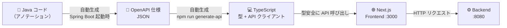
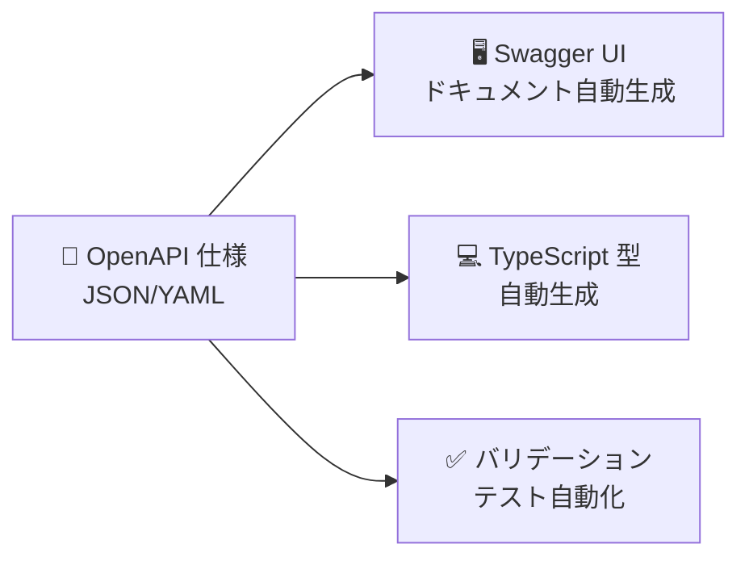
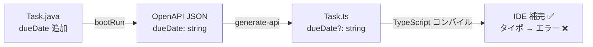

# 🔄 Swagger Hands-on: 型安全なフルスタック開発

**Spring Boot (Java) + Next.js (TypeScript) + OpenAPI/Swagger**

Backend で定義した API から OpenAPI 仕様を自動生成し、そこから TypeScript クライアントを自動生成する「型安全なフルスタック開発」を体験するハンズオンです。目安は **2時間** です。

---

## 📖 目次

1. [技術スタック](#1-技術スタック)
2. [なぜ型安全が必要か](#2-なぜ型安全が必要か)
3. [OpenAPI / Swagger とは](#3-openapi--swagger-とは)
4. [環境確認とアプリ起動](#4-環境確認とアプリ起動)
5. [Swagger UI を確認する](#5-swagger-ui-を確認する)
6. [Backend の OpenAPI 定義を読む](#6-backend-の-openapi-定義を読む)
7. [TypeScript クライアントを生成する](#7-typescript-クライアントを生成する)
8. [生成されたコードを確認する](#8-生成されたコードを確認する)
9. [Backend を変更して型エラーを体験する](#9-backend-を変更して型エラーを体験する)
10. [演習問題](#10-演習問題)
11. [解答](#11-解答)
12. [トラブルシューティング](#12-トラブルシューティング)
13. [参考リンク](#13-参考リンク)

---

## 1. 技術スタック

| 分類 | 技術 | バージョン | 役割 |
|------|------|----------|------|
| Backend | Java | 17+ | 言語 |
| Backend | Spring Boot | 3.4.x | Web フレームワーク |
| Backend | SpringDoc OpenAPI | 2.5.0 | OpenAPI 仕様の自動生成 |
| Frontend | Next.js | 16.x | React フレームワーク |
| Frontend | TypeScript | 5.x | 型付き JavaScript |
| Frontend | openapi-typescript-codegen | 0.30.x | TypeScript クライアント自動生成 |

### 全体の流れ



**Java コードが「唯一の情報源（Single Source of Truth）」** です。OpenAPI 仕様も TypeScript 型もすべて Java コードから自動で生成されるため、手動でドキュメントや型を書く必要はありません。

---

## 2. なぜ型安全が必要か

### API の「約束」がズレると起きること

Frontend と Backend の約束が食い違っても、JavaScript では**エラーが出ません**。

たとえば Backend 開発者が `title` フィールドを `task_title` に変更したとします。

**Backend が返す JSON（変更後）**

```json
{ "id": 1, "task_title": "Swagger定義を作成する", "status": "TODO" }
```

**Frontend のコード（変更を知らないまま）**

```javascript
const task = await response.json();
console.log(task.title);              // undefined（エラーは出ない！）
element.textContent = task.title;     // 画面のタスク名が空欄になる
```

**ブラウザの表示（画面が壊れる）**

```
┌────────────────────────────────┐
│ タスク名:            ← 空欄！  │
│ ステータス: TODO               │
└────────────────────────────────┘
← 本来は "Swagger定義を作成する" が表示されるべき
```

| なぜ気づきにくいのか | 理由 |
|-------------------|------|
| JavaScript はエラーを出さない | 存在しないキーは `undefined` を返すだけでクラッシュしない |
| 画面が壊れても動き続ける | 空欄になるだけでアプリは機能している |
| 発覚が遅れる | テスト・レビューを通過し、本番でお客様が踏むまで気づかない |

### 型安全があれば即座に検知できる

OpenAPI 仕様から生成した TypeScript 型を使うと、**コーディング中**にバグを検知できます。

```typescript
//                ↓ 大文字 Task：型・クラス名（設計図）
import type { Task } from "@/generated/api/models/Task";  // 自動生成された型

//       ↓ 小文字 task：変数名（設計図から作られた実際のデータ）
const task: Task = await TasksService.getTask(1);

task.tittle;             // ❌ コンパイルエラー（タイポを即検知）
task.status = "YOLO";   // ❌ コンパイルエラー（許可されていない値）
task.title;              // ✅ OK

task.status = Task.status.TODO;  // ✅ OK（enum で安全に指定）
```
| | 型安全なし | 型安全あり |
|--|-----------|----------|
| バグ発見タイミング | 実行時・テスト・本番 | コーディング中（即座） |
| 修正コスト | 高い（原因調査が必要） | 低い（エラー箇所が明確） |
| API 変更の影響 | 気づかず画面が壊れる | コンパイルエラーで全箇所を把握 |
| リファクタリング | 怖い（影響範囲が不明） | 安心（壊れたら教えてくれる） |

---

## 3. OpenAPI / Swagger とは

### OpenAPI とは

**OpenAPI Specification（OAS）** は、API の仕様を **機械が読める JSON/YAML** で記述するための標準仕様です。



「機械が読める」ことで、ドキュメント・型・テストがすべて**ツールで自動生成**できます。

| 従来（Word / Confluence） | OpenAPI |
|--------------------------|---------|
| 人が手で書く → すぐ古くなる | コードから自動生成できる |
| 人しか読めない | ツールが自動処理できる |
| 実装と乖離しやすい | 実装と常に同期 |

### OpenAPI ドキュメントの構造

OpenAPI の JSON は主に 3 つのブロックで構成されています。

| ブロック | 役割 | このプロジェクトでの例 |
|---------|------|---------------------|
| `info` | API 全体のメタ情報 | タイトル・バージョン |
| `paths` | エンドポイントの定義 | `GET /api/tasks` のパラメーター・レスポンス型 |
| `components.schemas` | データモデルの定義 | `Task` の型・制約・enum 値 |

### Swagger とは

**Swagger** は OpenAPI 仕様を扱うツール群のブランド名です。「仕様」と「ツール」が混同されがちなので整理します。

```
2011年  Swagger 誕生（API 記述仕様 + ツール群のブランド）
  ↓
2015年  仕様部分を Linux Foundation に寄贈
        → 仕様の名称が「OpenAPI Specification」に改名
  ↓
現在    OpenAPI = 仕様のルール
        Swagger = ツール群（UI・Editor・Codegen）
```

> 💡 **OpenAPI = 設計図のルール、Swagger = 設計図を扱う道具箱**

---

## 4. 環境確認とアプリ起動

### 必要なツールの確認

以下を実行してバージョンを確認してください。

```bash
java -version    # 17 以上
node -v          # v18 以上
npm -v           # 9 以上
```

### リポジトリのクローン

```bash
git clone https://github.com/fkei753/swagger-handson.git
cd swagger-handson
```

### Backend の起動

```bash
cd backend
./gradlew bootRun
```

> macOS / Linux で `Permission denied` が出た場合: `chmod +x ./gradlew` を実行してから再試行

起動完了後、以下の URL にアクセスできます。

| URL | 内容 |
|-----|------|
| http://localhost:8080/swagger-ui.html | Swagger UI（API ドキュメント） |
| http://localhost:8080/api-docs | OpenAPI 仕様 JSON（生データ） |

### Frontend のセットアップ

**別ターミナル**で実行します。

```bash
cd frontend
npm ci
```

---

## 5. Swagger UI を確認する

http://localhost:8080/swagger-ui.html にアクセスしてください。

Swagger UI でできること:

| 操作 | 説明 |
|------|------|
| API 一覧の閲覧 | `Tasks` / `Users` タブでエンドポイントの一覧を確認 |
| パラメーター確認 | 各エンドポイントを開くとリクエスト・レスポンスの型が表示される |
| **Try it out** | ブラウザから直接 API を実行できる |
| Schemas | 画面下部でモデルの全フィールド・制約を確認できる |

**✅ やってみよう**

1. `Tasks` セクションを開く
2. `GET /api/tasks` → **Try it out** → **Execute**
3. レスポンスボディに JSON 配列が返ることを確認する
4. `POST /api/tasks` で `title` を空にして送信 → `400 Bad Request` になることを確認する

---

## 6. Backend の OpenAPI 定義を読む

SpringDoc OpenAPI ライブラリが Java のアノテーションを読み取り、Spring Boot 起動時に自動で OpenAPI 仕様 JSON を生成します。

### モデルクラス（`Task.java`）

```java
@Schema(description = "タスク情報")
public class Task {

    @Schema(description = "タスクID", example = "1", accessMode = Schema.AccessMode.READ_ONLY)
    private Long id;

    @NotBlank(message = "タイトルは必須です")
    @Size(min = 1, max = 200)
    @Schema(description = "タスクのタイトル", example = "Swagger定義を作成する",
            requiredMode = Schema.RequiredMode.REQUIRED)
    private String title;

    @NotNull(message = "ステータスは必須です")
    @Schema(description = "タスクの状態", requiredMode = Schema.RequiredMode.REQUIRED)
    private TaskStatus status;

    // ...（description, priority, assigneeId, createdAt, updatedAt も同様）
}
```

### コントローラー（`TaskController.java`）

```java
@Tag(name = "Tasks", description = "タスク管理API")
@RestController
@RequestMapping("/api/tasks")
public class TaskController {

    @GetMapping
    @Operation(summary = "タスク一覧取得", description = "ステータスや優先度でフィルタリング可能")
    @ApiResponse(responseCode = "200", description = "取得成功")
    public ResponseEntity<List<Task>> getAllTasks(
            @Parameter(description = "ステータスでフィルタ")
            @RequestParam(required = false) TaskStatus status) { ... }
}
```

### アノテーション対応表

| Java のアノテーション | OpenAPI / Swagger UI に反映される内容 |
|-------------------|-------------------------------------|
| `@Schema(description = "...")` | フィールドの説明文 |
| `@Schema(accessMode = READ_ONLY)` | `"readOnly": true`（POST 時に無視される） |
| `@Schema(requiredMode = REQUIRED)` | `required` 配列に追加（必須フィールド） |
| `@NotBlank` / `@Size(max = 200)` | `"minLength"` / `"maxLength": 200` |
| `enum TaskStatus { TODO, ... }` | `"enum": ["TODO", ...]` |
| `@Tag(name = "Tasks")` | Swagger UI のグループ名（タブ） |
| `@Operation(summary = "...")` | エンドポイントの概要説明 |
| `@ApiResponse(responseCode = "200")` | レスポンスステータスの定義 |

### 生成された JSON を確認する

```bash
curl -s http://localhost:8080/api-docs | python3 -m json.tool | head -80
```

`paths` → `/api/tasks` → `get` にパラメーター・レスポンス定義が、`components` → `schemas` → `Task` にモデル定義が生成されていることを確認してください。

---

## 7. TypeScript クライアントを生成する

`frontend` ディレクトリで以下を実行します。

```bash
cd frontend
npm run generate-api
```

このコマンドは内部で 2 ステップを実行します。

```bash
# ① Backend から OpenAPI 仕様 JSON をローカルファイルに保存
curl -s http://localhost:8080/api-docs -o openapi.json

# ② ローカルファイルから TypeScript クライアントを生成
openapi --input ./openapi.json --output src/generated/api --client fetch
```

> 💡 URL を直接 `--input` に渡さずローカルファイルを経由するのは、内部ライブラリ（`@apidevtools/json-schema-ref-parser` v14+）が HTTP リゾルバーを内蔵しなくなったためです。

エラーなく完了すれば `src/generated/api/` にファイルが生成されます。

---

## 8. 生成されたコードを確認する

### 生成されるファイル構成

```
src/generated/api/
├── models/
│   ├── Task.ts          ← Java の Task クラスが TypeScript 型に変換
│   ├── User.ts
│   └── ApiError.ts
├── services/
│   ├── TasksService.ts  ← TaskController のメソッドが API クライアントに変換
│   └── UsersService.ts
└── core/                  # HTTP 通信の基盤（変更不要）
```

### 生成された型（`models/Task.ts`）

```typescript
export type Task = {
    readonly id?: number;         // READ_ONLY → readonly
    title: string;                // REQUIRED → 必須プロパティ
    description?: string;         // オプション → ?
    status: Task.status;          // Java の enum → TypeScript enum
    priority: Task.priority;
    assigneeId?: number;
    readonly createdAt?: string;  // READ_ONLY → readonly
    readonly updatedAt?: string;
};

export namespace Task {
    export enum status {
        TODO = 'TODO',
        IN_PROGRESS = 'IN_PROGRESS',
        IN_REVIEW = 'IN_REVIEW',
        DONE = 'DONE',
    }
    export enum priority {
        LOW = 'LOW',
        MEDIUM = 'MEDIUM',
        HIGH = 'HIGH',
        CRITICAL = 'CRITICAL',
    }
}
```

**Java の `readOnly` / `required` / `enum` がそのまま TypeScript の型制約に変換されています。**

### 生成されたサービス（`services/TasksService.ts`）

```typescript
export class TasksService {
    // GET /api/tasks → TypeScript メソッドに変換
    public static getAllTasks(status?: Task.status): CancelablePromise<Array<Task>> { ... }
    // POST /api/tasks
    public static createTask(requestBody: Task): CancelablePromise<Task> { ... }
    // GET /api/tasks/{id}
    public static getTask(id: number): CancelablePromise<Task> { ... }
}
```

### Frontend での使い方

`frontend/src/app/page.tsx` や各コンポーネントで以下のように使います。

```typescript
import { OpenAPI } from "@/generated/api/core/OpenAPI";
import { TasksService } from "@/generated/api/services/TasksService";
import type { Task } from "@/generated/api/models/Task";

// API のベース URL を設定（起動時に一度だけ）
OpenAPI.BASE = "http://localhost:8080";

// タスク一覧取得（戻り値は Task[] と推論される）
const tasks: Task[] = await TasksService.getAllTasks();

// タスク作成（型に合わない値はコンパイルエラー）
await TasksService.createTask({
    title: "新しいタスク",
    status: Task.status.TODO,      // enum で安全に指定
    priority: Task.priority.HIGH,  // enum で安全に指定
});
```

---

## 9. Backend を変更して型エラーを体験する

**このセクションがハンズオンのメインです。** Backend の定義を変えると Frontend の型が自動で追随することを体験します。

### 手順

**① `Task.java` に `dueDate` フィールドを追加**

```java
// backend/src/main/java/com/example/swagger/model/Task.java

// import に追加
import java.time.LocalDate;

// フィールドを追加（他のフィールドの後ろに追記）
@Schema(description = "期限日", example = "2025-12-31")
private LocalDate dueDate;

// getter / setter を追加
public LocalDate getDueDate() { return dueDate; }
public void setDueDate(LocalDate dueDate) { this.dueDate = dueDate; }
```

**② Backend を再起動**

```bash
# 起動中のターミナルで Ctrl+C → 再起動
./gradlew bootRun
```

**③ TypeScript クライアントを再生成**

```bash
cd frontend && npm run generate-api
```

**④ 生成された `Task.ts` を確認**

`src/generated/api/models/Task.ts` を開くと `dueDate?: string;` が追加されています。

```typescript
export type Task = {
    readonly id?: number;
    title: string;
    // ...
    dueDate?: string;   // ← 追加された！
};
```

**⑤ Frontend で型エラーを実際に確認する**

型エラーは **IDE の赤波線** または **TypeScript コンパイラ** で確認します。

**手順 1: 検証用ファイルを作成する**

```bash
# frontend ディレクトリで実行
touch src/app/type-check-test.ts
```

**手順 2: 以下のコードを貼り付けて保存する**

```typescript
// frontend/src/app/type-check-test.ts
import { TasksService } from "@/generated/api/services/TasksService";

async function test() {
  const task = await TasksService.getTaskById(1);

  console.log(task.dueDate);   // ✅ OK（型が保証されている）
  console.log(task.dueDat);    // ❌ タイポ（わざと間違えている）
  console.log(task.due_date);  // ❌ スネークケース（わざと間違えている）
}
```

**手順 3: TypeScript コンパイラでチェックを実行する**

```bash
cd frontend
npx tsc --noEmit
```

**期待される出力（エラーが 2 件表示される）**

```
src/app/type-check-test.ts:7:20 - error TS2339: Property 'dueDat' does not exist on type 'Task'.
src/app/type-check-test.ts:8:20 - error TS2339: Property 'due_date' does not exist on type 'Task'.

Found 2 errors.
```

`task.dueDate` だけエラーが出ず、タイポ・誤ったフィールド名はコンパイルエラーになることを確認してください。

**手順 4: 検証用ファイルを削除する**

```bash
rm src/app/type-check-test.ts
```

> 💡 **IDE（VS Code / IntelliJ）を使っている場合**  
> ファイルを保存した時点でエラー箇所に赤波線が表示されます。  
> 赤波線が出ない場合は `Ctrl+Shift+P` → `TypeScript: Restart TS Server` を実行してください。

### まとめ：変更がどう伝わるか



---

## 10. 演習問題

### 課題 1: 統計 API の追加

Backend に `GET /api/tasks/stats` エンドポイントを追加して、ステータスごとのタスク数を返す API を作成してください。

**要件:**
- レスポンス形式: `{ "countByStatus": { "TODO": 2, "IN_PROGRESS": 1, "DONE": 1 } }`
- `@Schema` / `@Operation` アノテーションを付ける
- `npm run generate-api` 後に `TasksService.getStats()` が補完に出ることを確認する

<details>
<summary>ヒント</summary>

1. `TaskStats.java` という新しいモデルクラスを `model/` ディレクトリに作成する
2. `TaskController` に `@GetMapping("/stats")` メソッドを追加する
3. `tasks.values().stream().collect(Collectors.groupingBy(...))` でステータス別に集計できる

</details>

---

### 課題 2: バリデーションの追加

セクション 9 で追加した `dueDate` フィールドに、過去日を拒否するバリデーションを追加してください。

**要件:**
- `@FutureOrPresent` アノテーションを使う
- Swagger UI の `POST /api/tasks` で過去日（例: `"2020-01-01"`）を入力するとエラーになることを確認する

<details>
<summary>ヒント</summary>

`jakarta.validation.constraints.FutureOrPresent` をインポートして `dueDate` フィールドに付与します。

</details>

---

### 課題 3: エラーハンドリングの統一

現在、バリデーションエラー時のレスポンスは Spring デフォルトの形式（フィールドが多く読みにくい）です。これを `ApiError` クラスを使った統一フォーマットに変更してください。

**要件:**
- `@ControllerAdvice` を使ったグローバル例外ハンドラーを作成する
- `MethodArgumentNotValidException` をキャッチして `ApiError` を返す
- 期待するレスポンス:

```json
{
  "status": 400,
  "message": "バリデーションエラー",
  "detail": "title: タイトルは必須です"
}
```

<details>
<summary>ヒント</summary>

`config/` ディレクトリに `GlobalExceptionHandler.java` を作成し、`@ControllerAdvice` + `@ExceptionHandler(MethodArgumentNotValidException.class)` を使います。

</details>

---

## 11. 解答

### 課題 1 の解答

**① `TaskStats.java` を新規作成**

```java
// backend/src/main/java/com/example/swagger/model/TaskStats.java
package com.example.swagger.model;

import io.swagger.v3.oas.annotations.media.Schema;
import java.util.Map;

@Schema(description = "タスク統計情報")
public class TaskStats {

    @Schema(description = "ステータスごとのタスク数")
    private Map<String, Long> countByStatus;

    public TaskStats(Map<String, Long> countByStatus) {
        this.countByStatus = countByStatus;
    }

    public Map<String, Long> getCountByStatus() { return countByStatus; }
    public void setCountByStatus(Map<String, Long> v) { this.countByStatus = v; }
}
```

**② `TaskController.java` にエンドポイントを追加**

```java
// 既存の import はそのまま。以下を追記
import com.example.swagger.model.TaskStats;

// クラス内に追加
@GetMapping("/stats")
@Operation(summary = "タスク統計取得", description = "ステータスごとのタスク数を返します")
@ApiResponse(responseCode = "200", description = "取得成功")
public ResponseEntity<TaskStats> getStats() {
    Map<String, Long> countByStatus = tasks.values().stream()
        .collect(Collectors.groupingBy(
            t -> t.getStatus().name(),
            Collectors.counting()
        ));
    return ResponseEntity.ok(new TaskStats(countByStatus));
}
```

**③ 確認**

```bash
# Backend 再起動
./gradlew bootRun

# TypeScript クライアント再生成
cd frontend && npm run generate-api
```

`services/TasksService.ts` に `getStats()` メソッドが追加され、レスポンスが `TaskStats` 型で型付けされていることを確認。

---

### 課題 2 の解答

**`Task.java` を修正**

```java
// import を追加
import jakarta.validation.constraints.FutureOrPresent;
import java.time.LocalDate;

// dueDate フィールドのアノテーションを修正
@FutureOrPresent(message = "期限日は本日以降の日付を指定してください")
@Schema(description = "期限日", example = "2025-12-31")
private LocalDate dueDate;

// getter / setter（セクション 9 で追加済みの場合は不要）
public LocalDate getDueDate() { return dueDate; }
public void setDueDate(LocalDate dueDate) { this.dueDate = dueDate; }
```

**確認**

Backend 再起動 → Swagger UI で `POST /api/tasks` に `"dueDate": "2020-01-01"` を含めて送信 → `400 Bad Request` が返ることを確認。

---

### 課題 3 の解答

**`GlobalExceptionHandler.java` を新規作成**

```java
// backend/src/main/java/com/example/swagger/config/GlobalExceptionHandler.java
package com.example.swagger.config;

import com.example.swagger.model.ApiError;
import org.springframework.http.ResponseEntity;
import org.springframework.web.bind.MethodArgumentNotValidException;
import org.springframework.web.bind.annotation.ControllerAdvice;
import org.springframework.web.bind.annotation.ExceptionHandler;

import java.util.stream.Collectors;

@ControllerAdvice
public class GlobalExceptionHandler {

    @ExceptionHandler(MethodArgumentNotValidException.class)
    public ResponseEntity<ApiError> handleValidation(MethodArgumentNotValidException ex) {
        String detail = ex.getBindingResult().getFieldErrors().stream()
            .map(e -> e.getField() + ": " + e.getDefaultMessage())
            .collect(Collectors.joining(", "));

        ApiError error = new ApiError(400, "バリデーションエラー", detail);
        return ResponseEntity.badRequest().body(error);
    }
}
```

**確認**

Backend 再起動 → Swagger UI で `POST /api/tasks` に `"title": ""` を送信。

レスポンス:

```json
{
  "status": 400,
  "message": "バリデーションエラー",
  "detail": "title: タイトルは必須です"
}
```

---

## 12. トラブルシューティング

### `./gradlew bootRun` で `Permission denied` が出る

```bash
chmod +x ./gradlew
./gradlew bootRun
```

---

### `npm run generate-api` が `ECONNREFUSED` で失敗する

Backend が起動していません。

```bash
curl http://localhost:8080/api-docs
```

JSON が返ってこない場合は Backend を起動してから再試行してください。

---

### `Port 8080 was already in use` が出る

```bash
# 使用中のプロセスを確認
lsof -i :8080

# 表示された PID を終了
kill -9 <PID>
```

---

### ブラウザに CORS エラーが出る

`backend/src/main/java/com/example/swagger/config/WebConfig.java` を確認し、`allowedOrigins` に `http://localhost:3000` が含まれているか確認してください。

---

### 型が更新されない（変更後も補完に出てこない）

1. Backend を再起動したか確認
2. `npm run generate-api` を再実行したか確認
3. VS Code の TypeScript サーバーをリセット: `Ctrl+Shift+P` → `TypeScript: Restart TS Server`

---

### `generate-api` 後に型エラーが大量発生する

**正常な動作です。** Backend の変更が型に反映され、影響箇所がすべてコンパイルエラーとして可視化されています。エラーの指示に従って修正すれば、修正漏れが起きません。

---

## 13. 参考リンク

- [SpringDoc OpenAPI 公式ドキュメント](https://springdoc.org/)
- [OpenAPI 3.0 仕様](https://swagger.io/specification/)
- [openapi-typescript-codegen](https://github.com/ferdikoomen/openapi-typescript-codegen)
- [Spring Boot 公式](https://spring.io/projects/spring-boot)
- [Next.js 公式](https://nextjs.org/)

---

